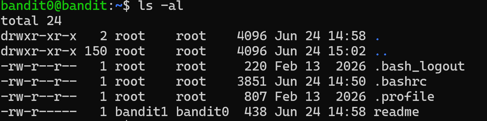
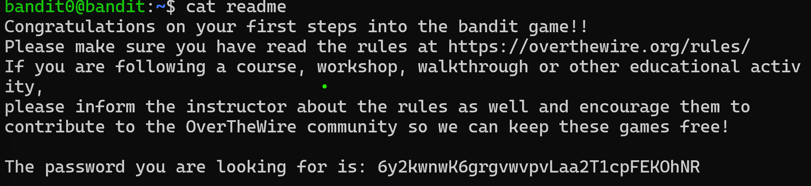

# Bandit Level 0 -> 1 

## Nhiệm vụ
Mật khẩu cho cấp độ tiếp theo được lưu trong một tệp có tên readme nằm trong thư mục chính. Sử dụng mật khẩu này để đăng nhập vào bandit1 bằng SSH. 

## Các lệnh gợi ý:
- ls (List): Liệt kê danh sách các tệp tin và thư mục trong thư mục hiện tại
- cd (Change Directory): Di chuyển giữa các thư mục
- cat (Concatenate): Đọc, hiển thị nội dung của một hoặc nhiều tệp tin văn bản ra màn hình
- file: Kiểm tra và xác định định dạng/kiểu dữ liệu thực sự của một tệp tin
- du (Disk Usage): Kiểm tra dung lượng đĩa cứng mà các tệp tin hoặc thư mục đang chiếm dụng 
- find: Tìm kiếm tệp tin hoặc thư mục theo nhiều tiêu chí 

## Các bước thực hiện
1. Kiểm tra thư mục hiện tại có những gì
``` bash
ls -al
```


2. Dùng lệnh hiển thị nội dung của file readme
``` bash
cat readme
```


## Mật khẩu:
``` bash
6y2kwnwK6grgvwvpvLaa2T1cpFEKOhNR
```