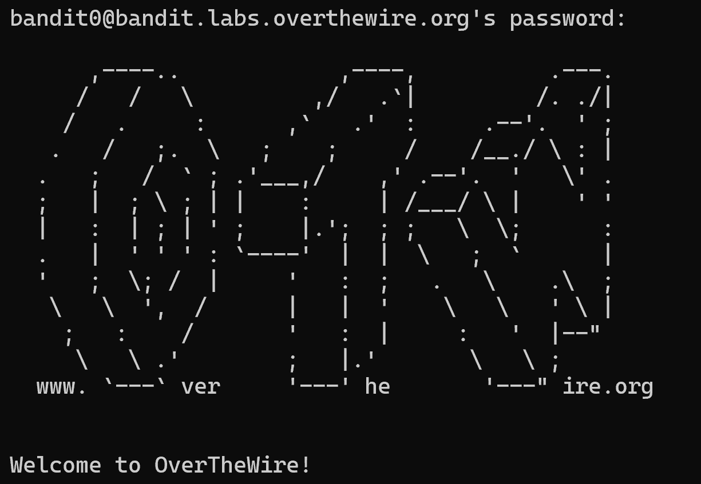

# Bandit Level 0 

## Nhiệm vụ
Mục tiêu của cấp độ này là bạn đăng nhập vào trò chơi bằng SSH. 
+ Host: bandit.labs.overthewire.org
+ User: bandit0
+ Pass: bandit0
+ Port: 2220

## Các bước thực hiện
+ Sử dụng cú pháp:
``` bash
ssh user@host -p port
```
với các thông tin đã cho, ra được kết quả:
