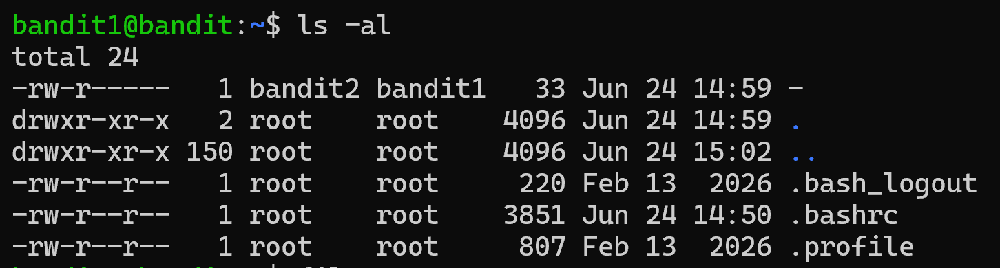
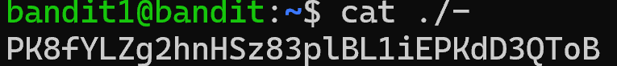

# Bandit Level 1 - 2

## Nhiệm vụ
Mật khẩu cho cấp độ tiếp theo được lưu trong một tệp có tên - nằm trong thư mục chính.

## Các bước thực hiện
1. Sử dụng cú pháp:
``` bash
ssh bandit1@hbandit.labs.overthewire.orgost -p 2220
```
với mật khẩu từ lv trước để chuyển màn.

2. Kiểm tra thư mục hiện tại có những gì
``` bash
ls -al
```


3. Dùng lệnh hiển thị nội dung của file - (Lưu ý:Để tránh việc terminal hiểu nhầm - là một tùy chọn câu lệnh, bạn cần thêm đường dẫn tương đối hoặc tuyệt đối vào trước tên tệp)
``` bash
cat ./-
```


## Mật khẩu 
``` bash
PK8fYLZg2hnHSz83plBL1iEPKdD3QToB
```