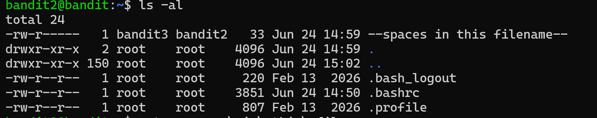

# Bandit Level 2 - 3

## Nhiệm vụ
Mật khẩu cho cấp độ tiếp theo được lưu trong một tệp có tên --spaces in this filename--nằm trong thư mục chính.

## Các bước thực hiện
1. Kiểm tra thư mục hiện tại có những gì
``` bash
ls -al
```


2. Dùng lệnh hiển thị nội dung của file - (Lưu ý:Trên tất cả các hệ điều hành hiện đại, dấu cách được cho phép trong tên tệp.Tuy nhiên, chúng thường gây ra lỗi trong các kịch bản lập trình, URL web và giao diện dòng lệnh vì máy tính thường sử dụng dấu cách để phân tách các lệnh hoặc đối số khác nhau, bạn cần bao quanh bằng dấu ngoặc kép đơn tên tệp)
``` bash
 cat ./'--spaces in this filename--'
```


## Mật khẩu 
``` bash
7ZZ2LFrykP2zEyvBl4m3clcL7tGYJPME
```