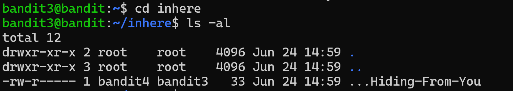

# Bandit Level 3 - 4

## Nhiệm vụ
Mật khẩu cho cấp độ tiếp theo được lưu trữ trong một tệp ẩn trong thư mục inhere .

## Các bước thực hiện
1. Sử dụng lệnh cd để chuyển thư mục:
``` bash
cd inhere
```

2. Kiểm tra thư mục hiện tại có những gì
``` bash
ls -al
```


3. Dùng lệnh hiển thị nội dung của file 
``` bash
cat ...Hiding-From-You
```


## Mật khẩu 
``` bash
xzTXq1rDJQVVAzdv5cHq1TQytTWufAMq
```