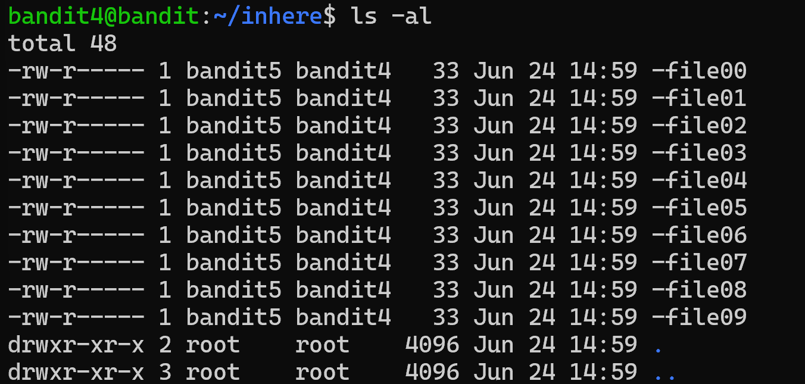
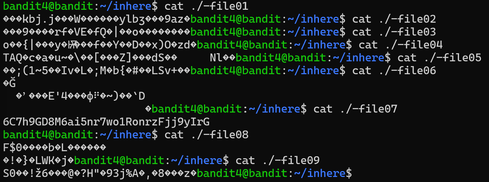

# Bandit Level 4 - 5

## Nhiệm vụ
Mật khẩu cho cấp độ tiếp theo được lưu trữ trong tệp duy nhất mà con người có thể đọc được trong thư mục inhere . Mẹo: nếu thiết bị đầu cuối của bạn bị lỗi, hãy thử lệnh “reset”.
## Các bước thực hiện
1. Sử dụng lệnh cd để chuyển thư mục:
``` bash
cd inhere
```

2. Kiểm tra thư mục hiện tại có những gì
``` bash
ls -al
```


3. Vì có nhiều file nhưng số lượng không đáng kể, ta có thể dùng chay lệnh cat để check:



## Mật khẩu 
``` bash
6C7h9GD8M6ai5nr7wo1RonrzFjj9yIrG
```